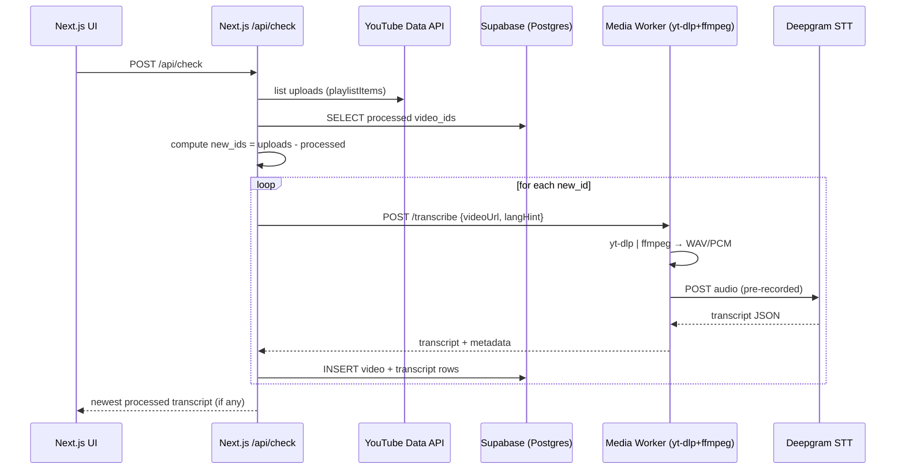

# PRD — “One-Button YouTube → Transcript” (Next.js + Supabase + Deepgram)

## 1) Summary

Build a minimal Next.js web app with **one button** that, when clicked, will:

1. Check a **single, preconfigured YouTube channel** for any **new videos** not yet processed (tracked in Supabase).
2. For each new video, **extract audio**, run **STT via Deepgram**, store transcript + metadata in Supabase.
3. Return the **most recent new transcript** (if any) to the frontend for display.

> Assumption: We **own/have permission** for the channel and can programmatically fetch audio.

---

## 2) Goals & Non-Goals

**Goals**

* One-click, deterministic run (no background webhooks).
* Reliable detection of **unprocessed** uploads.
* Accurate transcription via Deepgram with language hints.
* Clear UI: show “new transcript(s)” or “no new uploads”.

**Non-Goals**

* No PubSub/WebSub or background scheduling.
* No multi-channel support (exactly one channel).
* No summarization, diarization, translations (initially).
* No role-based multi-user system (single admin view).

---

## 3) Primary User & UX

**User:** Owner/admin (you).
**UI:** A single page:

* Header with configured Channel Name/ID.
* **Primary CTA:** “Check for new videos”.
* **Result panel:** If found, show newest transcript title + published date + transcript body (collapsible).
* **History list (optional v1):** last N processed videos (title → view transcript).

---

## 4) Success Metrics

* **Freshness:** New video appears as “processed” within one button-press.
* **Reliability:** ≥ 98% successful transcriptions (excluding Deepgram/network failures).
* **Idempotence:** Repeated clicks don’t duplicate records.
* **Latency:** End-to-end transcript ready for a ≤ 15-min, 30–60-min, 2-hr video respectively (depends on STT mode—see §10).

---

## 5) System Overview (at a glance)

* **Next.js 15 (App Router)** for UI + API routes.
* **Supabase Postgres** to store processed video IDs and transcripts.
* **YouTube Data API** (polling) to list latest videos in channel uploads.
* **Media Worker** (Dockerized) with **yt-dlp** + **ffmpeg** to stream audio → **Deepgram** STT (pre-recorded or streaming).
* **Deepgram** returns transcript text (+ optional word timings).

---

## 6) Detailed Functional Requirements

### F1. Button-triggered check

* When user clicks “Check for new videos”:

  * Backend queries YouTube uploads (most recent 5–10 items).
  * Compare against Supabase `videos` table.
  * For each **new** ID:

    * Request transcription via Media Worker.
    * Persist transcript + metadata.
  * Respond to frontend with the *newest processed transcript* (or “No new uploads”).

### F2. Single channel config

* Channel is stored in server config (ENV or Supabase `settings` table).
* Ability to update **channel_id** via ENV or admin-only API.

### F3. Transcript storage & retrieval

* Store transcript as full text; optionally store time-aligned segments JSON.
* Provide `/api/transcripts/latest` to fetch the latest successful transcript.

### F4. Error handling

* If extraction or STT fails, mark `videos.status='failed'` with `notes`.
* Retries limited to 2 attempts per video ID (backoff).
* Display errors only in admin logs (UI shows a friendly “No new uploads” if none succeeded).

---

## 7) Non-Functional Requirements

**Reliability**

* Idempotent processing (unique `video_id` PK).
* Safe retries with statuses: `queued` → `processing` → `succeeded` | `failed`.

**Performance**

* Use **Deepgram pre-recorded** for long videos (faster wall-clock than real-time).
* Stream audio from yt-dlp to ffmpeg (no large temp files).

**Security**

* ENV secrets via platform (Vercel/Cloud Run secrets).
* Media Worker not public; protected with shared secret (HMAC header).

**Observability**

* Structured logs (video_id, duration, mode, latency).
* Basic metrics: success rate, average transcription time, size distribution.

---

## 8) Architecture & Data Flow



---

## 9) API Surface (internal)

### 9.1 Next.js Route Handlers

* `POST /api/check`

  * **Body:** `{ limit?: number }` (optional; default 5)
  * **Resp (200):**

    ```json
    {
      "processed": ["VIDEO_ID_1", "VIDEO_ID_2"],
      "latest": {
        "video_id": "VIDEO_ID_2",
        "title": "Title",
        "published_at": "2025-11-02T15:00:00Z",
        "transcript": "full text...",
        "segments": [ { "start": 0.0, "end": 3.2, "text": "..." } ]
      }
    }
    ```
* `GET /api/transcripts/latest`

  * **Resp (200):** latest successful transcript (same shape as above).
* `GET /api/videos`

  * Returns last N processed entries (status, published_at, title).

### 9.2 Media Worker (private)

* `POST /transcribe`

  * **Headers:** `X-Signature: HMAC256(body, MEDIA_WORKER_SECRET)`
  * **Body:** `{ "videoUrl": "https://www.youtube.com/watch?v=...", "langHint": "en", "mode":"prerecorded" }`
  * **Resp:** `{ "duration_sec": 1834, "text": "...", "segments": [...], "language": "en" }`

---

## 10) STT Strategy

**Default Mode:** **Deepgram pre-recorded**

* Convert best-audio stream to **mono 16kHz WAV** via `ffmpeg`.
* Upload bytes directly to Deepgram (or presign to object store and supply URL).
* Pros: Throughput and cost control; no real-time WS overhead.
* For very long videos, chunking is optional; Deepgram supports large files—benchmark and set a hard limit (e.g., 2 hours).

**Alternative (not default):** **Streaming WS**

* Only if you want progressive partials. Not needed for one-click batch UX.

---

## 11) Supabase Schema (minimal)

```sql
-- videos
create table if not exists public.videos (
  id text primary key,                -- YouTube video_id
  title text not null,
  published_at timestamptz not null,
  duration_sec int,
  status text not null default 'queued', -- queued|processing|succeeded|failed
  processed_at timestamptz,
  notes text
);

-- transcripts
create table if not exists public.transcripts (
  video_id text primary key references public.videos(id) on delete cascade,
  source text not null default 'deepgram',  -- deepgram
  language text,
  text text not null,
  segments jsonb,                            -- optional word/segment timings
  created_at timestamptz not null default now()
);

-- optional: settings
create table if not exists public.settings (
  key text primary key,
  value jsonb
);
```

**Indexes**

```sql
create index if not exists idx_videos_published_at on public.videos(published_at desc);
create index if not exists idx_videos_status on public.videos(status);
```

---

## 12) Configuration & Secrets

* `YOUTUBE_API_KEY` — Data API (playlistItems.list)
* `YOUTUBE_CHANNEL_ID` — target channel
* `SUPABASE_URL`, `SUPABASE_SERVICE_ROLE_KEY`
* `DEEPGRAM_API_KEY`
* `MEDIA_WORKER_URL`
* `MEDIA_WORKER_SECRET`
* (Optional) `LANG_HINT` (e.g., `en`)

---

## 13) Tech Choices & Deployment

* **Next.js** on Vercel or Node server. Use **Route Handlers** (Node runtime) for `/api/*`.
* **Media Worker**: Docker image with **yt-dlp** + **ffmpeg** + Node/Python.

  * Deploy on **Cloud Run**, **Fly.io**, or **Railway**.
  * CPU: ≥ 1 vCPU; Memory: ≥ 1–2 GB; Concurrency 1–5 (depends on length).
* **Supabase** managed Postgres.

---

## 14) Implementation Notes

**YouTube polling**

* Use the **uploads playlist** for the channel (one API call to get latest items).
* Fetch top N (5–10) newest and diff against DB; process only unseen.

**Media Worker**

* Command (conceptual):

  * `yt-dlp -f bestaudio -o - "$VIDEO_URL" | ffmpeg -i pipe:0 -ac 1 -ar 16000 -f wav pipe:1`
* Pipe to Deepgram pre-recorded with a streaming HTTP upload (no temp files).

**Retries**

* If media fetch fails: retry with exponential backoff (e.g., 30s, 2m).
* If STT fails: 1–2 retries; afterwards mark `failed`.

**Idempotence**

* `videos.id` is the YouTube video_id (PK).
* Before processing, check if `status in ('succeeded','processing')` and skip.

---

## 15) UI Spec (MVP)

* **Header:** Channel name (read-only).
* **Primary CTA:** “Check for new videos”.
* **Toast/Status line:** “Found 2 new uploads. Processing…”
* **Result card:** If success, show:

  * Title (link to YouTube), published date, duration.
  * Transcript (collapsible, copy button).
* **Empty state:** “No new uploads found.”

---

## 16) Telemetry & Logging

* Log fields: `video_id`, `title`, `published_at`, `duration_sec`, `stt_mode`, `wall_clock_ms`, `bytes_uploaded`, `status`.
* Counter metrics:

  * `transcriptions_total{status}` (succeeded/failed)
  * `transcription_latency_ms` (histogram)
* Alerts: failure rate > 10% in last 10 runs.

---

## 17) Privacy & Security

* All secrets in server envs; no client exposure.
* Media Worker requires HMAC signature; reject unauthenticated calls.
* Store transcripts in DB; restrict RLS to server-side only (no anon read unless intended).

---

## 18) Performance & Cost Guardrails

* **Max video length:** reject or queue > 2h by default (configurable).
* **Parallelism:** limit concurrent jobs (e.g., max 1–2 at a time).
* **Caching:** none required; DB acts as dedupe source.
* **Cost controls:** store text only; discard audio after STT (we never persist it).

---

## 19) Testing & Acceptance Criteria

**Unit**

* Diff logic returns only unseen IDs.
* Idempotent insert paths (second run = no duplicates).
* Worker signature verification.

**Integration**

* Given a known new upload:

  * `/api/check` → inserts `videos`(processing→succeeded), `transcripts` row created.
  * `/api/transcripts/latest` returns expected title/text.

**Acceptance**

* Click button after a real upload → transcript appears in UI within reasonable time (dependent on video length).
* Re-clicking yields “No new uploads” and does not duplicate DB rows.
* Failures are captured with `status='failed'` and `notes` set.

---

## 20) Rollout Plan

* **Phase 1 (MVP):** Button → poll → single new video → STT → display.
* **Phase 2 (Hardening):** Retries, error taxonomy, progress indicators, history list.
* **Phase 3 (Nice-to-Have):** Time-aligned rendering, search-in-transcript, export (.txt/.srt).

---

## 21) Open Questions

1. Do we want **segments/word-timings** stored (bigger payloads) or **text only**?
2. Enforce a **maximum runtime** per transcription to cap costs?
3. Should we expose a simple **/api/reprocess/:video_id** admin endpoint?

---

## 22) Minimal Pseudocode (for clarity only)

**/api/check**

```ts
// 1) list latest uploads
const latest = await listChannelUploads({ channelId, apiKey, max: 8 });

// 2) find new IDs
const seen = await db.selectVideoIds(latest.map(v => v.id));
const newOnes = latest.filter(v => !seen.includes(v.id));

// 3) process in series (or small concurrency)
for (const v of newOnes) {
  await db.upsertVideo({ id: v.id, title: v.title, published_at: v.publishedAt, status: 'processing' });
  const res = await postToMediaWorker({ videoUrl: `https://www.youtube.com/watch?v=${v.id}`, langHint: 'en' });
  if (res.ok) {
    await db.insertTranscript({ video_id: v.id, text: res.text, segments: res.segments, language: res.language });
    await db.markVideoSucceeded(v.id);
  } else {
    await db.markVideoFailed(v.id, res.error);
  }
}

// 4) return newest processed transcript (if any)
return await db.fetchLatestTranscript();
```

**Media Worker (sketch)**

```bash
yt-dlp -f bestaudio -o - "$VIDEO_URL" \
 | ffmpeg -i pipe:0 -ac 1 -ar 16000 -f wav pipe:1 \
 | curl -X POST "https://api.deepgram.com/v1/listen?model=general&language=en" \
     -H "Authorization: Token $DEEPGRAM_API_KEY" \
     --data-binary @-
```


github repo to initialize and use - https://github.com/Atiwari330/youtube_auto_v1.git 
---


